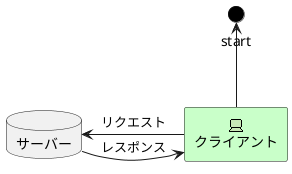

<!-- TOC -->


<!-- /TOC -->

# 1. Markdownの書き方について

## 1.1. Markdownとは

簡単に文章作成ができるツールである

## 1.2. 目的

- Markdownの書き方のチートシートを作成し、今後の業務効率を向上させる
- 将来的なブログ作成に向けての原本を作成する

## 1.3. 事前準備

- vscodeをinstall
- TOCを生成する際のバグを回避するために以下の動作を行う
  - 設定を開く
  - Eolを検索しauto→/nと変更する
  

- おすすめ拡張機能
  - 入れ方
  以下の部分から検索してインストールする

  
  
|アプリ名|機能|
|---|---|
|Auto Markdown TOC|右クリックを押すと章番号や目次を入れることができる|
|Markdown All in one|便利機能盛沢山|
|Markdown Paste|画像を挿入できる|
|Paste Images|画像を挿入できる|
|Markdown PDF|マークダウンをPDFに変更できる|
|Zenkaku|全角のスペースを見やすくする|
|PlantUML|UMLを作成できる|
|Markdownlist|HTMLの記述用語が使える|
|Markdown Preview Enhanced|Markdownの結果が見れる|
|Githistory|gitの更新履歴を確認できる|

補足：Auto Markdown TOC を有効にするには
設定で以下の項目にチェックをつける


## 1.4. MarkDownの基本的な記述方法

||記述方法|出力例|
|---|---|---|
|太字|`**a**`|**a**|
|イタリック|`***a***`|***a***|
|見出し|# 見出し||
|リンク1|`[リンク](a.jp)`|[リンク](a.jp)|
|リンク2|`<http://example.com>`|<http://example.com>|
|リンク3|`http://example.com`|http://example.com|
|画像|``||
|引用|>||
|箇条書き|- example||
|箇条書き（番号付き）|1. ||
|水平線|---||
|code|``|`a`|
|codeブロック|||
|表|||
|チェックボタン|- [ ] example or - [x] example||
|打消し|`~~example~~`|~~example~~|
|絵文字|`:smile: :heart: :+1:`|:smile::heart::+1:|

## 1.5. plantUMLについて

### コンポーネント図

>'```plantuml
>@startuml
>scale 400 width
>package "adapter" #gainboro{
>    [sample.dll]
>}
>
>package "ライブラリ"{
>  frame "sampleライブラリ"{
>    [sample1.dll]
>  }
>
>  frame "sample2ライブラリ"{
>    [sample2.dll]
>  }
>}
>
>[sample.dll] -down-> [sample1.dll]
>[sample1.dll]-left->[sample2.dll]
>@enduml
>'```

```plantuml
@startuml
' 上記がないとgithubで表示できない
scale 400 width
' 大きさを規定
package "adapter" #gainboro{
    [sample.dll]
}

package "ライブラリ"{
  frame "sampleライブラリ"{
    [sample1.dll]
  }

  frame "sample2ライブラリ"{
    [sample2.dll]
  }
}

[sample.dll] -down-> [sample1.dll]
[sample1.dll]-left->[sample2.dll]
@enduml
```

### 1.5.1. アーキテクチャ図

>'```plantuml
>@startuml
>!define samplecircle circle #black
>
>samplecircle start
>
>archimate #Technology "クライアント" as client >`<<technology-device>>`
>
>database "サーバー" as server
>
>client -up-> start
>client -left->server:リクエスト
>client<-right-server:レスポンス
>
>@enduml
>'```



### 1.5.2. ユースケース

>``plantuml
>left to right direction
>
>actor "service"  as Adapter  
>rectangle Query{
>  usecase "検索する"  as indexQuery
>} 
>Adapter --> indexQuery
>@enduml
>``

```plantuml
left to right direction 

actor "service"  as Adapter  
rectangle Query{
  usecase "検索する"  as indexQuery
} 
Adapter --> indexQuery
@enduml
```


