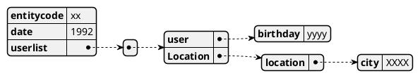
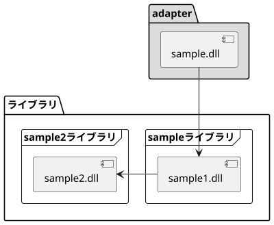
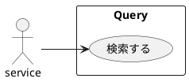
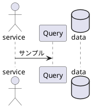
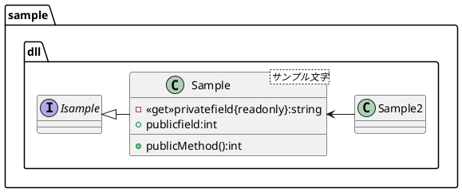
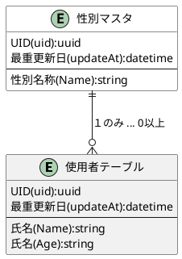

<!-- @import "[TOC]" {cmd="toc" depthFrom=1 depthTo=6 orderedList=false} -->

<!-- code_chunk_output -->

- [1. Markdownの書き方について](#1-markdownの書き方について)
  - [1.1. Markdownとは](#11-markdownとは)
  - [1.2. 目的](#12-目的)
  - [1.3. 事前準備](#13-事前準備)
  - [1.4. MarkDownの基本的な記述方法](#14-markdownの基本的な記述方法)
  - [1.5. plantUMLについて](#15-plantumlについて)
    - [1.5.1. json](#151-json)
    - [1.5.2. コンポーネント図](#152-コンポーネント図)
    - [1.5.3. アーキテクチャ図](#153-アーキテクチャ図)
    - [1.5.4. ユースケース](#154-ユースケース)
    - [1.5.5. シーケンス図](#155-シーケンス図)
    - [1.5.6. クラス図](#156-クラス図)
    - [1.5.7. ER図](#157-er図)

<!-- /code_chunk_output -->

# 1. Markdownの書き方について

## 1.1. Markdownとは

簡単に文章作成ができるツールである

## 1.2. 目的

- Markdownの書き方のチートシートを作成し、今後の業務効率を向上させる
- 将来的なブログ作成に向けての原本を作成する

## 1.3. 事前準備

- vscodeをinstall
- TOCを生成する際のバグを回避するために以下の動作を行う
  - 設定を開く
  - Eolを検索しauto→/nと変更する
  

- おすすめ拡張機能
  - 入れ方
  以下の部分から検索してインストールする

  
  
|アプリ名|機能|
|---|---|
|Auto Markdown TOC|右クリックを押すと章番号や目次を入れることができる|
|Markdown All in one|便利機能盛沢山|
|Markdown Paste|画像を挿入できる|
|Paste Images|画像を挿入できる|
|Zenkaku|全角のスペースを見やすくする|
|PlantUML|UMLを作成できる|
|Markdownlist|HTMLの記述用語が使える|
|Markdown Preview Enhanced|Markdownの結果が見れる|
|Githistory|gitの更新履歴を確認できる|

補足：Auto Markdown TOC を有効にするには
設定で以下の項目にチェックをつける


- googlechromeで以下の拡張機能を入れる

1. Pegmatite(Githubのplantumlを表記してくれる)
2. Markdown Viewer

## 1.4. MarkDownの基本的な記述方法

||記述方法|出力例|
|---|---|---|
|太字|`**a**`|**a**|
|イタリック|`***a***`|***a***|
|見出し|# 見出し||
|リンク1|`[リンク](a.jp)`|[リンク](a.jp)|
|リンク2|`<http://example.com>`|<http://example.com>|
|リンク3|`http://example.com`|http://example.com|
|画像|``||
|引用|>||
|箇条書き|- example||
|箇条書き（番号付き）|1. ||
|水平線|---||
|code|``|`a`|
|codeブロック|||
|表|||
|チェックボタン|- [ ] example or - [x] example||
|打消し|`~~example~~`|~~example~~|
|絵文字|`:smile: :heart: :+1:`|:smile::heart::+1:|
|ページ内リンク|`[目的](#12-目的)`|[目的](#12-目的)|

## 1.5. plantUMLについて

### 1.5.1. json

>'```plantuml
>@startjson
>{
>  "entitycode":"xx",
>  "date":1992,
>  "userlist":
>  [
>    {
>    "user":
>    {
>      "birthday":"yyyy"
>    },
>    "Location":
>    {
>      "location":
>      {
>        "city":"XXXX"
>      }
>    }
>    }
>  ]
>}
@endjson
>'```



### 1.5.2. コンポーネント図

>'```plantuml
@staruml
>scale 400 width
>package "adapter" #gainboro{
>    [sample.dll]
>}
>
>package "ライブラリ"{
>  frame "sampleライブラリ"{
>    [sample1.dll]
>  }
>
>  frame "sample2ライブラリ"{
>    [sample2.dll]
>  }
>}
>
>[sample.dll] -down-> [sample1.dll]
>[sample1.dll]-left->[sample2.dll]
>@enduml
>'```



### 1.5.3. アーキテクチャ図

>'```plantuml
@startuml
>!define samplecircle circle #black
>
>samplecircle start
>
>archimate #Technology "クライアント" as client >`<<technology-device>>`
>
>database "サーバー" as server
>
>client -up-> start
>client -left->server:リクエスト
>client<-right-server:レスポンス
>
>@enduml
>'```


### 1.5.4. ユースケース

>``plantuml
 @startuml
>left to right direction
>
>actor "service"  as Adapter  
>rectangle Query{
>  usecase "検索する"  as indexQuery
>} 
>Adapter --> indexQuery
>@enduml
>``



### 1.5.5. シーケンス図

>'```plantuml
@startuml
>actor service
>participant Query
>database data
>
>service -> Query:サンプル
>
>@enduml
>'```



### 1.5.6. クラス図

プライベートは書かない


>```plantuml`
 @startuml
>package "sample.dll" {
> interface Isample
>  class Sample <サンプル文字>
>  {
>    `-` <`<get>`>privatefield{readonly}:string
>    `+` publicfield:int
>    `+` publicMethod():int
>  }
>  class Sample2
>  Isample<|-Sample
>  Sample<-Sample2
>}
>@enduml
>'```



### 1.5.7. ER図

>'```plantuml
 @startuml
>entity "使用者テーブル" as UserTable
>{
>  UID(uid):uuid
>  最重更新日(updateAt):datetime
>  `--`
>  氏名(Name):string
>  氏名(Age):string
>}
>
>entity "性別マスタ" as SeXMaster #FFF
>{
>  UID(uid):uuid
>  最重更新日(updateAt):datetime
>  `--`
>  性別名称(Name):string
>}
>
>SeXMaster||--o{ UserTable:１のみ ... 0以上
>@enduml
>'```


